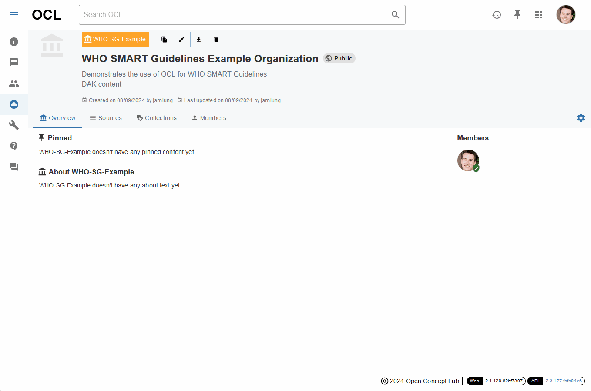
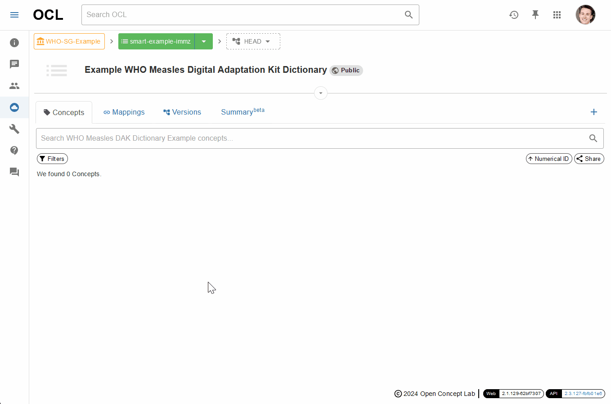
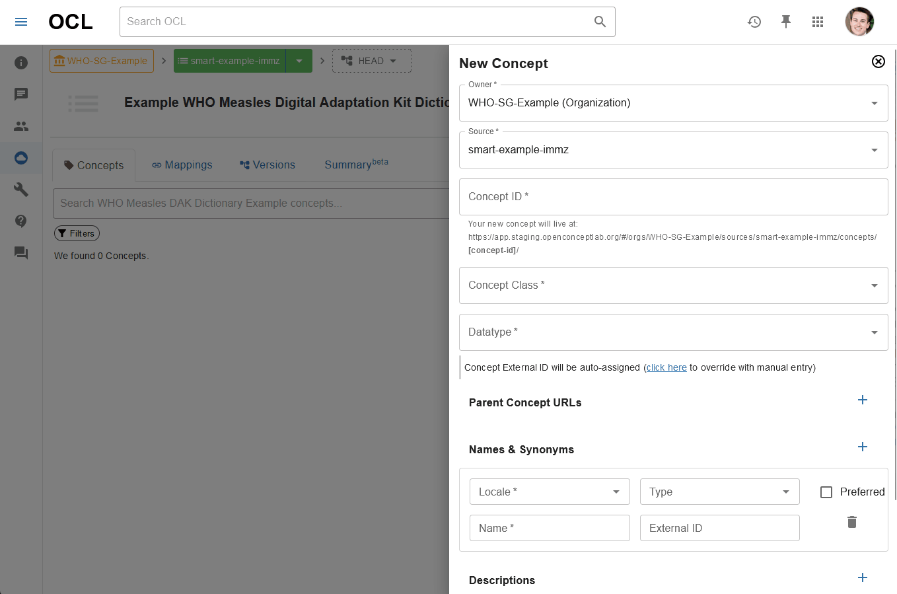
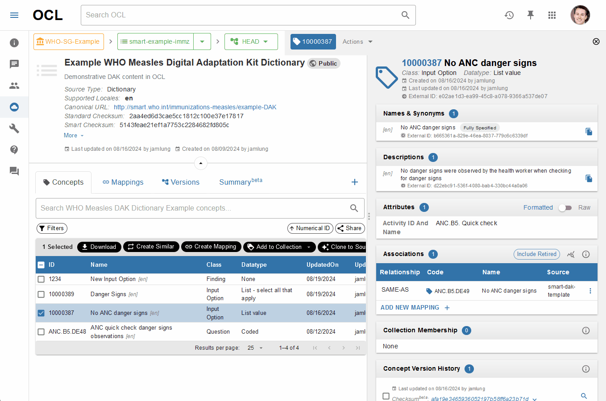
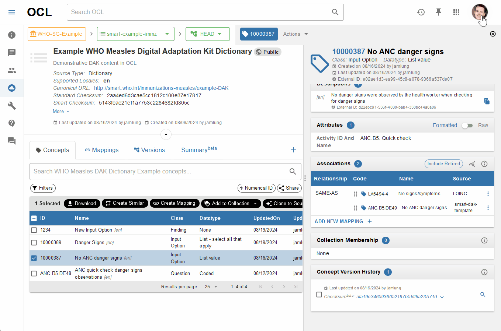
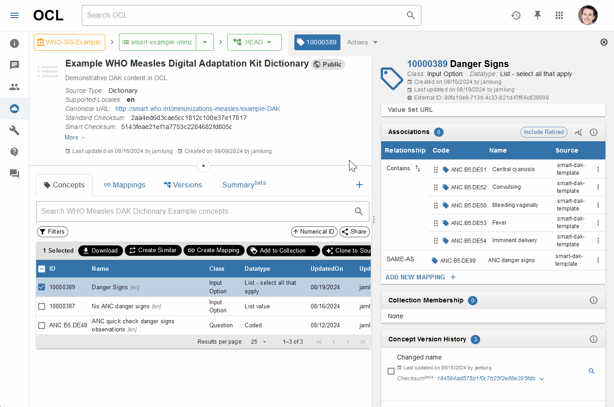
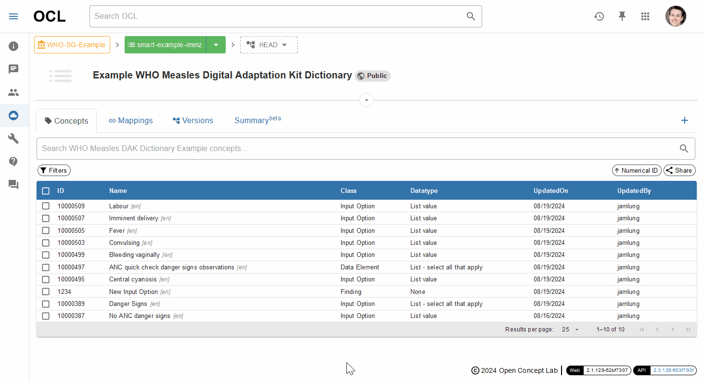

# To Dos

* Change headers to use more DAK author-like language (look at L2 SOP for examples)
* Include a section for importing a DAK data dictionary
* Add L3 language including:
  * How to get content back out of OCL as FHIR
  * How to put L3 content into an IG

# Setup and Prerequisites

1. An official OCL Organization should be created as the home for all WHO DAK content. In this example, it will be [WHO-SG-Example](https://app.staging.openconceptlab.org/#/orgs/WHO-SG-Example/sources/).
2. Developers of the DAK dictionary will have an OCL account in the appropriate OCL instance, and they have been added to the WHO organization as a member.
3. 

# Start up the DAK dictionary

1. 
2. Fill out required fields for this source, based on the DAK being developed.

   * Recommended Configurations for most DAKs:
     * Source Type: Dictionary
     * Validation Schema: TBD
     * Visibility: TBD (Private)
     * Canonical URL: TBD
     * FHIR Settings:
       * Purpose: [DAK one-word name]
       * **TBD:** Other common settings required e.g. Publisher?
   * Recommendation: To improve implementation of DAKs in OpenMRS instances, it is recommended that the OpenMRS Validation Schema is used, and External IDs in the "ID Auto-Assignment" section should all be set to "UUID" to give all concepts and names/descriptions a unique identifier.
     * **TBD:** Should the OpenMRS Validation Schema be used? It helps to reduce duplicate names within the DAK source, among other things that enhance implementability in OpenMRS.
   * **Note:** Sources will use the Purpose attribute as a way to tie DAK contents together, until resource packaging is supported in OCL.
3. It is recommended that preliminary descriptive information about the DAK is provided in the Source About page, if available. This is the place to describe in detail the intended use of the DAK, assumptions, and other important information about its contents. It is also an ideal place to link to the other artifacts, GitHub reposotories, etc. that are related to your DAK. This content can be added at any time but should be populated before releasing a version of the DAK in order to appear in your FHIR terminology resource(s).
4. Click "Create Source" to submit information and create the DAK source. Once the page refreshes, ensure that the Canonical URL of the source is visible and correct. Click on the Source to enter it and to view its contents.

# Creating Concepts in the DAK

Whether the data dictionary element represents a question, an answer, or something else, they all will be defined as concepts within the DAK source. We can give them different attributes to differentiate, and we can also add or manage mappings on concepts. These concepts can later be organized, enriched, or otherwise altered in the future, but we will focus on the initial creation of the concepts first.

Note that concepts should ideally be reused where possible, rather than created from scratch.

## Searching for and reusing concepts

Use the search bar at the top of the page to input keywords or other search terms that could help to find an existing concept that meets the need of the DAK dictionary that is being developed.

Using the search results provided, look for a concept that is similar to the requirement for the DAK dictionary. This includes a similar display name, description, Attributes, and Associations. Note that, particularly for question concepts, having some imperfect matching in the associations section can be acceptable since the mappings can be changed later.

In general, it is better to reuse a concept as long as the intended meaning of the concept matches the requirement. Consult the DAK management group for questions of similarity and appropriateness of reuse.

### $clone

OCL's cloning operation can recreate a concept and its mappings, making it easier to reuse (and possibly adapt) in the current DAK dictionary. When selecting one or more concepts in OCL, use the Clone to Source button to bring up a prompt that will enable you to preview and customize this operation to make copies of a concepts for your own dictionary.

Note that the clone operation by default will "cascade", meaning it will recreate both the concept and its mappings if those mappings are of a certain type. This operation can be customized to change how this cascade works.

### Visual example of searching and cloning


### Making adaptations to a cloned concept

Various adaptations can be made to concepts:

* Add new names/synonyms/descriptions, change the preferred name for the locale, etc.
* Change mappings or associations
* Change Attributes

Use OCL's Edit Concept button in the Actions menu to make these changes.

Adding translations to this concept can also be done using this action by creating new names and assigning a different Locale code to them.

Note that IDs cannot be changed on any concept.


### Questions and Discussions

* What is the order of preference of sources to search for concept reuse? Proposed order:
  * DAK Common Dictionary: Any concept can be reused verbatim or adapted (Note that any concepts from other DAK dictionaries should have a representation here, so no other DAK dictionaries should be required for searching unless they are in a pre-publication stage)
  * Other published DAKs
  * (DAK authors won't use this, but terminologists might use this as a starter or example) Reference Terminologies including ICD-10, ICD-11, SNOMED-GPS, LOINC, etc. (Note that these offer starting points but likely will need additional information to be usable for the DAK dictionary being developed)
  * (DAK authors won't use this, but terminologists might use this as a starter or example) CIEL? (Can simply be used as a reference for modeling the concepts, remaking a list of common answers to a question, etc.)
  * Other sources?
* $clone discussion: Reuse verbatim vs. adapting
  * **Verbatim use means that Common concepts includes everything that is being reused**
    * **E.g. if SMART common already had client name /registration, you will base it on SMART common**
    * **This is about declaring a dependency, when it comes to IG publication**
    * **Talk to Jose about this**
* Gap: $clone does not allow the user to manually input an ID - OCL instead autoassigns an ID. Should we support a WHO auto-ID schema, or perhaps should we change the clone operation to allow manual ID input?
  * **Define data element ID using the first place where it is used**
  * **Auto-id numbering is a good starter**
* Note: mappings to be confirmed by a terminologist before formal publication of L2/L3 artifacts e.g. correct map type, appropriate linkage, etc.

## Creating a Concept (e.g. a Data Element)

Click the "+" icon to "Add Concept". This will open the form to create a concept, which will contain the necessary fields to fill out for each data element.



Click the "Create" button to submit the concept to OCL. OCL may return errors if improper values are provided.

A visual example of populating the attributes for an OCL concept is shown below, using an example from the DAK Dictionary Template (**link to be added**):



See the Dictionary Checklist section for the required and optional attributes for concepts.

## Adding Mappings to a Concept

Any concept can have mappings, including the following:

* Internal mappings: Connect two concepts in the DAK dictionary
* External mappings: Link a DAK dictionary concept to an external vocabulary, such as ICD-10

OCL's Associations section within a concept's details page allows you to add a mapping from that concept to another concept. In general, **it is better to already know what concept you want to map to**, since this Add Mapping form is not ideal for searching for a concept. This may require opening up another OCL tab to search for concepts, or you may need to search for codes in another terminology's browser e.g. the ICD-10 Browser.

Once you know your concept that you want to map to, navigate to the concept's Associations section and use the "Add new mapping" option or the Three-dot menu of another mapping to open a form that will help you to create the new association between data element and input option(s). Select the applicable Map Type, then select the source (i.e. the dictionary or reference vocabulary) that will contain the concept to map to. If that source does not exist in OCL, contact the OCL administrator.

Then you can input the code or name of the concept to map to. If OCL does not recognize that code or name in the source, it will allow you to provide your own name to the concept. This ensures that you can still provide meaningful mappings to a concept that OCL does not recognize.

See below for visual examples of adding mappings to a concept.

**Check this:** This process should be used not only to map concept to reference vocabs, but also back to the Core DAK dictionary that will contain common concepts. If you cloned a Core DAK concept, however, then this step has likely already been done by OCL for you.

Adding a mapping to a concept that OCL recognizes:



Adding a mapping to a concept that OCL does not recognize:



## Creating input options for a coded data element

In the case that a new input option is needed for a coded data element (e.g. a new possible answer to a question concept), you first must create the concept in the DAK source, following the directions above. Searching for and reusing existing concepts is still preferable, but creating a new concept to serve as an input option will likely be needed at some point in the DAK development process.

Once all required input options for a coded data element have been created in the DAK source, open the details for the data element and navigate to the Associations section. Use the "Add new mapping" option or the Three-dot menu of another mapping to open a form that will help you to create the new association between data element and input option(s).

**TBD**: Which map type to use? (If mappings are used in this way at all?)



# Working with Value Sets

## Creating a value set from a data element's input options

Note: OCL collections are the repository type which contain other concepts, also known as a value set in FHIR terms.

1. Select the concepts to be added to the value set and click "Add to Collection"
   1. Create the value set (if not already existing) - Note that not all details need to be filled in now, but the Value Set's ID cannot be changed later.
2. A dialogue window will appear, which determines how much information should come into the collection with the selected concepts. In general, it is recommended to at least use the "Yes, include associated Mappings from the same source" cascade option.
3. Navigate to the newly added concepts in the value set to ensure that the appropriate concepts (and their mappings) were added into the value set correctly
4. **TBD:** Recommended - link the value set back to the data element concept using the "Value Set URL" (and "Value Set Canonical") attribute(s) (URL = OCL-specific URL, Canonical = Universal identifying URL)


## Adapting an existing value set

### Intensional value set adaptation

When an existing value set meets most of the requirements, but has slightly different values in the set for the DAK in development, the existing value set can be adapted using intensional references. Simply put, this allows the DAK developer to bring in another value set's contents using one command, rather than selecting concepts one at a time. Once that new value set has been started, new concepts can be added using the instructions in the "Creating a value set from a data element's input options" section. Concepts can also be removed from the value set by selecting the concepts and clicking "Remove references".

When removing concepts or mappings from a collection, OCL will often ask if you want to "Remove reference(s)" or "Exclude concept(s)/mapping(s) from collection". Often, OCL's recommended option there should be used. Since an intensional reference can bring in multiple concepts and mappings with it, the most common recommended option is to "Exclude" the concept, allowing you to essentially "include all concepts from another value set EXCEPT for this particular concept". Many exclusions can be made if multiple concepts should not appear in the value set.

All references, including those that brought content into the value set (i.e. Include references) and those that kept content out of the value set (i.e. Exclude references), can be seen in the collection's References tab. This may help to explain why content is or is not appearing in the collection.

Note that there are known issues with this workflow, so it is important to check the value set contents. If this method fails, follow the instructions in the "Extensional value set adaptation" section.

See the visual example below, where a new Danger Signs value set is created intensionally from the previous Danger Signs value set. Then, a concept is removed using an "Exclusion" reference.


### Extensional value set adaptation

When intensional value set building is not appropriate or working as expected, then it is appropriate to create new value sets using the similar method described in the "Creating a value set from a data element's input options" section. Concepts in the existing value set can be selected, one at a time, and added into the new, adapted value set. From that new value set, new concepts can be added or removed by selecting the concepts and clicking "Remove references" as described in the "Intensional value set adaptation" section.

# Managing versions

Save versions of all created repositories at the end of the development process when ready to share content for broader feedback. This can be done within the Version tab of all sources and collections (i.e. CodeSystems and ValueSets). Creating a version means that OCL will save your current progress in that repository.

Until a version is saved, all of your work done so far will live in the HEAD version of your repository. This is like a workspace, whereas the saved version is the more official "point in time" content set, which is frozen and cannot be edited. Implementers, e.g. systems who uptake the dictionary, should be directed towards specific repo versions in OCL, rather than the HEAD version.

Retrieving content in a FHIR format from an OCL repository is ONLY possible if a version has been saved.

Note that any version can be released or unreleased. This is a simple flag to let users know that the version is published and ready to go.

**TBD**: Versioning guidance? What version numbers should be used?



# Importing an existing DAK spreadsheet

Python scripts or other tools to prepare the DAK dictionary for import into OCL may be also used to create terminology resources in OCL. However, this likely will not fully follow the DAK model in OCL and will still require additional enrichment, mappings to DAK concepts, etc. in OCL.

[Bulk Import documentation](https://docs.openconceptlab.org/en/latest/oclapi/apireference/bulkimporting.html) for OCL is available to support users in creating dictionaries, value sets, concepts, mappings, etc. If spreadsheet-based DAK development is preferred, then bulk importing may be a viable option to create those resources in OCL, as long as the developer is comfortable with using existing tooling or with transforming the DAK spreadsheet into an OCL Bulk Import format (either CSV or JSON lines).

This method will often require some additional consultation from an OCL administrator or a SMART Guidelines community member.

Existing (albeit nascent and not fully tested and validated) tooling for this spreadsheet conversion also may be used, including the following:

* DAK spreadsheet converter (Python Notebook for converting L2 spreadsheet to OCL Bulk import format): https://github.com/jamlung-ri/WHO-SMART-Guidelines/blob/main/WHO%20Measles%20Dictionary%20Parsing%20and%20OCL%20Prep.ipynb
  * Converts DAK spreadsheet concepts into OCL bulk import files that create a single source, then organizes concepts into value sets, then creates versions of those value sets
* I-TECH L3 tooling (not yet endorsed, further documentation needed): https://github.com/I-TECH-UW/who_l3_smart_tools/

# Using OCL terminology resources for FHIR IG generation

As of August 2024, OCL is not currently established as a terminology server for the FHIR Implementation Guide (IG) publisher. This means that the IG Publisher cannot directly query OCL's FHIR terminology resources during the IG  However, OCL's terminology resources can be used in combination with the IG Publisher (including FSH/SUSHI files if needed) to generate a FHIR implementation guide.

## Retrieving FHIR resources from OCL

One of two main methods can be used to get FHIR terminology resources out of OCL. Regardless of which option is used, OCL's FHIR resources (CodeSystems, ValueSets, and ConceptMaps) need to be saved individually, not as FHIR bundles.

### Method 1: Get as FHIR bundle and extract out individual FHIR resources

OCL's API returns a bundle of resources when hitting appropriate endpoints for CodeSystem, ValueSet, and ConceptMap. In general, this should occur in the organization namespace in which the DAK dictionary was authored. Additionally, parameters can be specified to filter out the resources that are returned in the bundle.

The generic structure for these API requests is:

`https://fhir.[environment.]openconceptlab.org/orgs/[OCL Organization ID]/[FHIR resource to retrieve]/?[attribute to filter by]=[value]`

An more common example for these API requests in the context of SMART Guidelines is:

`https://fhir.staging.openconceptlab.org/orgs/WHO-SG-Example/CodeSystem/?purpose=Example`

This queries OCL's Staging server, looking in the "WHO-SG-Example" organization, getting the CodeSystem resource, but restricting to only CodeSystems with the "Purpose" attribute as "Example".

Using this query structure, you can retrieve all of the appropriate terminology resources in three queries: One for CodeSystem resources, one for ValueSet resources, and one for ConceptMap resources.

- Note: be sure to check that all expected terminology resources are in the bundle. If any are missing, check that all OCL repositories have a saved version (i.e. not the HEAD version).

Once the resources have been retrieved, tooling like this [Python script](https://github.com/jamlung-ri/WHO-SMART-Guidelines/blob/main/FHIR%20Bundle%20Parser/FHIR%20Bundle%20Parser.py) can be used to parse out the individual FHIR resources from the bundle. These resources should now be in their own individual JSON files, which can be used in subsequent steps.

### Method 2: Download and save FHIR resources individually

OCL's API can also return an individual FHIR terminology resource as its own JSON file, which can be saved off one-at-a-time.

The generic structure for these API requests is:

    `https://fhir.[environment.]openconceptlab.org/orgs/[OCL Organization ID]/[FHIR resource to retrieve]/[OCL Repository ID]/`

A more common example for these API requests in the context of SMART Guidelines is:

    `https://fhir.staging.openconceptlab.org/orgs/WHO-SG-Example/ValueSet/danger-signs/`

JSON files can be saved from your browser, Postman, Python, Google Sheets, or various other tools.

Once all the resources have been saved, they should be in their own individual JSON files, which can be used in subsequent steps.

## Preparing terminology resources for the IG Publisher

Place the FHIR resources into the GitHub repository that contains the other IG files, specifically in the subfolder "input/resources/"

After other L3 artifacts (CQL logic, FSH files, etc.) have been placed in the GitHub repo, the FHIR IG can be generated.

* Note: Other L3 artifacts can reference FHIR terminology resources from OCL (e.g. In a FSH file, bind a profile element to a ValueSet that came from OCL), following a similar workflow as if the terminology was being authored in FSH files. Use the terminology resource's Canonical URL attribute for this, such as the example FSH file shown below:

```
Profile: CatMeaslesImmunization
Parent: SGImmunization

* extension[administeredProduct]
  * valueCodeableConcept from http://smart.who.int/immunizations-measles/ValueSet/VSMeaslesVaccineProducts (required)
  // * valueReference only Reference(CatMeaslesVaccineProduct)
```

* In this example, the canonical URL "http://smart.who.int/immunizations-measles/ValueSet/VSMeaslesVaccineProducts" references [this OCL valueset](https://app.staging.openconceptlab.org/#/orgs/WHO-SMART-Measles-Test/collections/VSMeaslesVaccineProducts/).
  * Note: OCL enables searching by a canonical URL if you would like to verify the presence of a terminology resource in OCL. [Example search](https://app.staging.openconceptlab.org/#/search/?q=http://smart.who.int/immunizations-measles/ValueSet/VSMeaslesVaccineProducts&isTable=true&isList=false&page=1&type=collections) in the OCL Staging environment.

# Dictionary Checklist

The following tables display the required and optional attributes to be present when developing terminology artifacts for DAK dictionaries. Some of these attributes are required to create something within OCL, but all attributes in the Required section will be needed to publish the completed DAK to the SMART Guidelines community.

## DAK Dictionary (Source)

Many of the attributes specified in the DAK source will appear in the **FHIR CodeSystem resource(s)** once the DAK dictionary has been authored and getting ready for L3 publication.

### Required

| OCL Source Field                                     | FHIR or DAK Attribute                                                                                                                                                                                                                                                 | Expected or Example Value                                      | Notes                                                                                                                                                 |
| ---------------------------------------------------- | --------------------------------------------------------------------------------------------------------------------------------------------------------------------------------------------------------------------------------------------------------------------- | --------------------------------------------------------------- | ----------------------------------------------------------------------------------------------------------------------------------------------------- |
| Source ID                                            | [id](http://hl7.org/fhir/R4/resource-definitions.html#Resource.id "Resource.id : The logical id of the resource, as used in the URL for the resource. Once assigned, this value never changes.")                                                                            | smart-example-immz (Example)                                    | This attribute cannot be changed once assigned.                                                                                                       |
| Short Name                                           | [name](http://hl7.org/fhir/R4B/codesystem-definitions.html#CodeSystem.name "CodeSystem.name : A natural language name identifying the code system. This name should be usable as an identifier for the module by machine processing applications such as code generation.") | WHO Measles DAK Dictionary Example (Example)                    |                                                                                                                                                       |
| Full Name                                            | [title](http://hl7.org/fhir/R4B/codesystem-definitions.html#CodeSystem.title "CodeSystem.title : A short, descriptive, user-friendly title for the code system.")                                                                                                           | Example WHO Measles Digital Adaptation Kit Dictionary (Example) |                                                                                                                                                       |
| Default Langauge                                     | [language](http://hl7.org/fhir/R4/resource-definitions.html#Resource.language "Resource.language : The base language in which the resource is written.")                                                                                                                    | "en"                                                            | Other supported languages can be optionally specified. Uses two-letter language codes.                                                               |
| Source Type                                          | N/A                                                                                                                                                                                                                                                                   | **TBD**                                                   |                                                                                                                                                       |
| Visibility                                           | N/A                                                                                                                                                                                                                                                                   | **TBD**                                                   |                                                                                                                                                       |
| Canonical URL                                        | TBD                                                                                                                                                                                                                                                                   | **TBD**                                                   | This attribute is particularly important for FHIR Implementation Guides. While it can be changed, it is recommended to stay consistent if possible. |
| (ID Autoassignment) Concept IDs                      | N/A                                                                                                                                                                                                                                                                   | Sequential (Expected)                                           | Automatically assigns IDs to concepts using sequential numbers. Only works for new concepts, not existing concepts in the source.                     |
| (ID Autoassignment) Mapping IDs                      | N/A                                                                                                                                                                                                                                                                   | Sequential (Expected)                                           | Automatically assigns IDs to mappings using sequential numbers. Only works for new mappings, not existing mappings in the source.                    |
| (ID Autoassignment) Concept External IDs             | N/A                                                                                                                                                                                                                                                                   | UUID (Expected)                                                 | Automatically assigns unique UUIDs to concepts, which is required for implementation in OpenMRS instances                                             |
| (ID Autoassignment) Mapping External IDs             | N/A                                                                                                                                                                                                                                                                   | UUID (Expected)                                                 | Automatically assigns unique UUIDs to mappings, which is required for implementation in OpenMRS instances                                             |
| (ID Autoassignment) Concept Name External IDs        | N/A                                                                                                                                                                                                                                                                   | UUID (Expected)                                                 | Automatically assigns unique UUIDs to concept names, which is required for implementation in OpenMRS instances                                        |
| (ID Autoassignment) Concept Description External IDs | N/A                                                                                                                                                                                                                                                                   | UUID (Expected)                                                 | Automatically assigns unique UUIDs to concept descriptions, which is required for implementation in OpenMRS instances                                 |
| Purpose                                              | [purpose](http://hl7.org/fhir/R4/codesystem-definitions.html#CodeSystem.purpose "CodeSystem.purpose : Explanation of why this code system is needed and why it has been designed as it has.")                                                                               | "ANC" (Example)                                                 | This field will be used to query within a DAK domain e.g. "HIV". See FHIR spec for other intended uses.                                               |
|                                                      |                                                                                                                                                                                                                                                                       |                                                                 |                                                                                                                                                       |

### Optional

| OCL Source Field    | FHIR or DAK Attribute                                                                                                                                                                                                                                                                                                                                                                                                                                                                                                                | Expected or Example Value                                      | Notes                                                                                                                              |
| ------------------- | ------------------------------------------------------------------------------------------------------------------------------------------------------------------------------------------------------------------------------------------------------------------------------------------------------------------------------------------------------------------------------------------------------------------------------------------------------------------------------------------------------------------------------------ | --------------------------------------------------------------- | ---------------------------------------------------------------------------------------------------------------------------------- |
| Description         | [description](http://hl7.org/fhir/R4/codesystem-definitions.html#CodeSystem.description "CodeSystem.description : A free text natural language description of the code system from a consumer's perspective.")                                                                                                                                                                                                                                                                                                                             | "Demonstrative DAK content in OCL" (Example)                    |                                                                                                                                    |
| Supported Languages | N/A                                                                                                                                                                                                                                                                                                                                                                                                                                                                                                                                  | "es" (Example)                                                  | Uses two-letter language codes                                                                                                     |
| Validation Schema   | N/A                                                                                                                                                                                                                                                                                                                                                                                                                                                                                                                                  | OpenMRS (**TBD**)                                         | Using the OpenMRS Validation schema may make authoring more difficult, but it enables OpenMRS instances to use DAK content better. |
| Website             | N/A                                                                                                                                                                                                                                                                                                                                                                                                                                                                                                                                  | https://www.who.int/publications/i/item/9789240020306 (Example) |                                                                                                                                    |
| External ID         | N/A                                                                                                                                                                                                                                                                                                                                                                                                                                                                                                                                  | "smart-anc" (Example)                                           |                                                                                                                                    |
| Publisher           | [publisher](http://hl7.org/fhir/R4/codesystem-definitions.html#CodeSystem.publisher "CodeSystem.publisher : The name of the organization or individual that published the code system.")                                                                                                                                                                                                                                                                                                                                                   |                                                                 | See FHIR spec for intended use                                                                                                     |
| Jurisdiction        | [jurisdiction](http://hl7.org/fhir/R4/codesystem-definitions.html#CodeSystem.jurisdiction "CodeSystem.jurisdiction : A legal or geographic region in which the code system is intended to be used.")                                                                                                                                                                                                                                                                                                                                       |                                                                 | See FHIR spec for intended use                                                                                                     |
| Copyright           | [copyright](http://hl7.org/fhir/R4/codesystem-definitions.html#CodeSystem.copyright "CodeSystem.copyright : A copyright statement relating to the code system and/or its contents. Copyright statements are generally legal restrictions on the use and publishing of the code system.")                                                                                                                                                                                                                                                   |                                                                 | See FHIR spec for intended use                                                                                                     |
| Identifier          | [identifier](http://hl7.org/fhir/R4/codesystem-definitions.html#CodeSystem.identifier "CodeSystem.identifier : A formal identifier that is used to identify this code system when it is represented in other formats, or referenced in a specification, model, design or an instance.")                                                                                                                                                                                                                                                    |                                                                 | See FHIR spec for intended use                                                                                                     |
| Contact             | [contact](http://hl7.org/fhir/R4/codesystem-definitions.html#CodeSystem.contact "CodeSystem.contact : Contact details to assist a user in finding and communicating with the publisher.")                                                                                                                                                                                                                                                                                                                                                  |                                                                 | See FHIR spec for intended use                                                                                                     |
| Content Type        | [content](http://hl7.org/fhir/R4/codesystem-definitions.html#CodeSystem.content "CodeSystem.content : The extent of the content of the code system (the concepts and codes it defines) are represented in this resource instance.")                                                                                                                                                                                                                                                                                                        |                                                                 | See FHIR spec for intended use                                                                                                     |
| Meta                | [meta](http://hl7.org/fhir/R4/resource.html#Resource "The metadata about the resource. This is content that is maintained by the infrastructure. Changes to the content might not always be associated with version changes to the resource.")                                                                                                                                                                                                                                                                                             |                                                                 | See FHIR spec for intended use                                                                                                     |
| Revision Date       | [date](http://hl7.org/fhir/R4/codesystem-definitions.html#CodeSystem.date "CodeSystem.date : The date  (and optionally time) when the code system was published. The date must change when the business version changes and it must change if the status code changes. In addition, it should change when the substantive content of the code system changes.")                                                                                                                                                                            |                                                                 | See FHIR spec for intended use                                                                                                     |
| Experimental        | [experimental](http://hl7.org/fhir/R4/codesystem-definitions.html#CodeSystem.experimental "CodeSystem.experimental : A Boolean value to indicate that this code system is authored for testing purposes (or education/evaluation/marketing) and is not intended to be used for genuine usage.")                                                                                                                                                                                                                                            |                                                                 | See FHIR spec for intended use                                                                                                     |
| Case Sensitive      | [caseSensitive](http://hl7.org/fhir/R4/codesystem-definitions.html#CodeSystem.caseSensitive "CodeSystem.caseSensitive : If code comparison is case sensitive when codes within this system are compared to each other.")                                                                                                                                                                                                                                                                                                                   |                                                                 | See FHIR spec for intended use                                                                                                     |
| Compositional       | [compositional](http://hl7.org/fhir/R4/codesystem-definitions.html#CodeSystem.compositional "CodeSystem.compositional : The code system defines a compositional (post-coordination) grammar.")                                                                                                                                                                                                                                                                                                                                             |                                                                 | See FHIR spec for intended use                                                                                                     |
| Version Needed      | [versionNeeded](http://hl7.org/fhir/R4/codesystem-definitions.html#CodeSystem.versionNeeded "CodeSystem.versionNeeded : This flag is used to signify that the code system does not commit to concept permanence across versions. If true, a version must be specified when referencing this code system.")                                                                                                                                                                                                                                 |                                                                 | See FHIR spec for intended use                                                                                                     |
| About Text          | [text](http://hl7.org/fhir/R4/domainresource-definitions.html#DomainResource.text "DomainResource.text : A human-readable narrative that contains a summary of the resource and can be used to represent the content of the resource to a human. The narrative need not encode all the structured data, but is required to contain sufficient detail to make it &quot;clinically safe&quot; for a human to just read the narrative. Resource definitions may define what content should be represented in the narrative to ensure clinical safety.") |                                                                 | See FHIR spec for intended use                                                                                                     |

### Questions and Discussions

* Are any of these Optional attributes actually required? What requirements or guidance are there? Or is it open ended for now?
* Please populate "TBD" values

## Concept Attributes

Many of the attributes specified in these concepts represent columns from the L2 data dictionary spreadsheet.

### Required

When creating concepts (data elements or input options), the following OCL fields should be populated (using these values from the DAK data dictionary if available):

| OCL Concept Field              | DAK Data Dictionary Attribute   | Example Value                                                             | Notes                                                                                                                                       |
| ------------------------------ | -------------------------------- | -------------------------------------------------------------------------- | ------------------------------------------------------------------------------------------------------------------------------------------- |
| Concept ID                     | Data element ID                  | ANC.B5.DE48                                                                | This ID value is permanent and cannot later be changed on a concept.                                                                        |
| Concept Class                  | "Data Element" or "Input Option" | Data Element                                                               | Other values may be permitted by WHO DAK community.                                                                                         |
| Datatype                       | Data type                        | TBD                                                                        | TBD                                                                                                                                         |
| (Names & Synonyms) Locale      | N/A                              | en                                                                         | Use whatever locale (i.e. language code) is applicable to the name                                                                          |
| (Names & Synonyms) Name       | Data element label               | ANC danger signs                                                           | Multiple names and synonyms can be added, each with their own Locale and Type                                                               |
| (Names & Synonyms) Type        | N/A                              | Fully-Specified                                                            | Describes which name type should apply to this concept name. Having at least one preferred fully specified name per locale is recommended. |
| (Names & Synonyms) External ID | N/A                              | N/A                                                                        | If the OCL source is configured properly, then OCL will automatically assign this value.                                                    |
| (Names & Synonyms) Preferred   | N/A                              | ✓                                                                         | Designates that the name is preferred within this locale                                                                                    |
| (Descriptions) Locale         | N/A                              | en                                                                         | Use whatever locale (i.e. language code) is applicable to the name                                                                          |
| (Descriptions) Name           | Description and definition       | "Indicates observations health worker made when checking for danger signs" | Multiple descriptions can be added, each with their own Locale and Type.                                                                    |
| (Descriptions) Type           | N/A                              | Definition                                                                 | Describes which type should apply to this concept description. Having at least one Definition per locale is recommended.                    |
| (Descriptions) External ID    | N/A                              | N/A                                                                        | If the OCL source is configured properly, then OCL will automatically assign this value.                                                    |
| (Descriptions) Preferred       | N/A                              | ✓                                                                         | Designates that the description is preferred within this locale                                                                             |

### Optional

Additionally, the following attributes from the DAK can be defined as Custom (AKA Extra) Attributes in OCL if applicable:

| DAK Attribute                                      | OCL Extra Attribute                  | Example Value                                                                                              |
| -------------------------------------------------- | ------------------------------------ | ---------------------------------------------------------------------------------------------------------- |
| Activity ID and name                               | Activity_ID_and_name                 | ANC.B5. Quick check                                                                                        |
| Quantity subtype                                   | Quantity_subtype                     | Integer quantity                                                                                           |
| Validation condition                               | Validation_condition                 | Must be a date and time value                                                                              |
| Optionality                                        | Optionality                          | R                                                                                                          |
| Explain conditionality                             | Explain_conditionality               | Required if client was tested for other specified STI (STI tested for [Data Element ID] = Other (specify)) |
| Functional grouping of data elements               | Functional_grouping_of_data_elements | Immunization event                                                                                         |
| Linkages to decision-support tables                | Linkages_to_decision_support_tables  | TBD                                                                                                        |
| Linkages to scheduling logic tables                | Linkages_to_scheduling_logic_tables  | TBD                                                                                                        |
| Linkages to aggregate indicators                   | Linkages_to_Aggregate_Indicators     | TBD                                                                                                        |
| Annotations                                        | Annotations                          | This field can also be calculated as defined by member states                                              |
| Intended FHIR Resource for profile (if available) | HL7_FHIR_R4_Resource                 | TBD                                                                                                        |

### Questions and Discussions

* Data type: Need to figure out how DAK values map to OCL values
* Concept Class - currently using this as "Data Element" vs. "Input Option". How does WHO actually want to use this? Example - CIEL uses diagnoses, tests, question/answers, concept sets, etc.
* Name type: What is the OpenMRS requirement for this value? How are synonyms represented?
* Where should we be managing potential values for fields like "Optionality"? Should we make OCL value sets?
* Are any of these Extra Attributes required? What requirements or guidance are there? Or is it open ended for now?
* Please populate "TBD" values in Dictionary Checklist section

## Value Sets (Collections)

Be sure to include "Purpose" attribute as the main DAK attribute?

Many of the attributes specified in the DAK collections in OCL will appear in the **FHIR ValueSet resource(s)** once the DAK dictionary has been authored and getting ready for L3 publication.

### Required

| OCL Source Field                                     | FHIR or DAK Attribute                                                                                                                                                                                                                                                 | Expected or Example Value                                      | Notes                                                                                                                                                 |
| ---------------------------------------------------- | --------------------------------------------------------------------------------------------------------------------------------------------------------------------------------------------------------------------------------------------------------------------- | --------------------------------------------------------------- | ----------------------------------------------------------------------------------------------------------------------------------------------------- |
| Source ID                                            | [id](http://hl7.org/fhir/R4/resource-definitions.html#Resource.id "Resource.id : The logical id of the resource, as used in the URL for the resource. Once assigned, this value never changes.")                                                                            | smart-example-immz (Example)                                    | This attribute cannot be changed once assigned.                                                                                                       |
| Short Name                                           | [name](http://hl7.org/fhir/R4B/codesystem-definitions.html#CodeSystem.name "CodeSystem.name : A natural language name identifying the code system. This name should be usable as an identifier for the module by machine processing applications such as code generation.") | WHO Measles DAK Dictionary Example (Example)                    |                                                                                                                                                       |
| Full Name                                            | [title](http://hl7.org/fhir/R4B/codesystem-definitions.html#CodeSystem.title "CodeSystem.title : A short, descriptive, user-friendly title for the code system.")                                                                                                           | Example WHO Measles Digital Adaptation Kit Dictionary (Example) |                                                                                                                                                       |
| Default Langauge                                     | [language](http://hl7.org/fhir/R4/resource-definitions.html#Resource.language "Resource.language : The base language in which the resource is written.")                                                                                                                    | "en"                                                            | Other supported languages can be optionally specified. Uses two-letter language codes.                                                               |
| Source Type                                          | N/A                                                                                                                                                                                                                                                                   | **TBD**                                                   |                                                                                                                                                       |
| Visibility                                           | N/A                                                                                                                                                                                                                                                                   | **TBD**                                                   |                                                                                                                                                       |
| Canonical URL                                        | TBD                                                                                                                                                                                                                                                                   | **TBD**                                                   | This attribute is particularly important for FHIR Implementation Guides. While it can be changed, it is recommended to stay consistent if possible. |
| (ID Autoassignment) Concept IDs                      | N/A                                                                                                                                                                                                                                                                   | Sequential (Expected)                                           | Automatically assigns IDs to concepts using sequential numbers. Only works for new concepts, not existing concepts in the source.                     |
| (ID Autoassignment) Mapping IDs                      | N/A                                                                                                                                                                                                                                                                   | Sequential (Expected)                                           | Automatically assigns IDs to mappings using sequential numbers. Only works for new mappings, not existing mappings in the source.                    |
| (ID Autoassignment) Concept External IDs             | N/A                                                                                                                                                                                                                                                                   | UUID (Expected)                                                 | Automatically assigns unique UUIDs to concepts, which is required for implementation in OpenMRS instances                                             |
| (ID Autoassignment) Mapping External IDs             | N/A                                                                                                                                                                                                                                                                   | UUID (Expected)                                                 | Automatically assigns unique UUIDs to mappings, which is required for implementation in OpenMRS instances                                             |
| (ID Autoassignment) Concept Name External IDs        | N/A                                                                                                                                                                                                                                                                   | UUID (Expected)                                                 | Automatically assigns unique UUIDs to concept names, which is required for implementation in OpenMRS instances                                        |
| (ID Autoassignment) Concept Description External IDs | N/A                                                                                                                                                                                                                                                                   | UUID (Expected)                                                 | Automatically assigns unique UUIDs to concept descriptions, which is required for implementation in OpenMRS instances                                 |
| Purpose                                              | [purpose](http://hl7.org/fhir/R4/codesystem-definitions.html#CodeSystem.purpose "CodeSystem.purpose : Explanation of why this code system is needed and why it has been designed as it has.")                                                                               | "ANC" (Example)                                                 | This field will be used to query within a DAK domain e.g. "HIV". See FHIR spec for other intended uses.                                               |
|                                                      |                                                                                                                                                                                                                                                                       |                                                                 |                                                                                                                                                       |

### Optional

| OCL Source Field    | FHIR or DAK Attribute                                                                                                                                                                                                                                                                                                                                                                                                                                                                                                                | Expected or Example Value                                      | Notes                                                                                                                              |
| ------------------- | ------------------------------------------------------------------------------------------------------------------------------------------------------------------------------------------------------------------------------------------------------------------------------------------------------------------------------------------------------------------------------------------------------------------------------------------------------------------------------------------------------------------------------------ | --------------------------------------------------------------- | ---------------------------------------------------------------------------------------------------------------------------------- |
| Description         | [description](http://hl7.org/fhir/R4/codesystem-definitions.html#CodeSystem.description "CodeSystem.description : A free text natural language description of the code system from a consumer's perspective.")                                                                                                                                                                                                                                                                                                                             | "Demonstrative DAK content in OCL" (Example)                    |                                                                                                                                    |
| Supported Languages | N/A                                                                                                                                                                                                                                                                                                                                                                                                                                                                                                                                  | "es" (Example)                                                  | Uses two-letter language codes                                                                                                     |
| Validation Schema   | N/A                                                                                                                                                                                                                                                                                                                                                                                                                                                                                                                                  | OpenMRS (**TBD**)                                         | Using the OpenMRS Validation schema may make authoring more difficult, but it enables OpenMRS instances to use DAK content better. |
| Website             | N/A                                                                                                                                                                                                                                                                                                                                                                                                                                                                                                                                  | https://www.who.int/publications/i/item/9789240020306 (Example) |                                                                                                                                    |
| External ID         | N/A                                                                                                                                                                                                                                                                                                                                                                                                                                                                                                                                  | "smart-anc" (Example)                                           |                                                                                                                                    |
| Publisher           | [publisher](http://hl7.org/fhir/R4/codesystem-definitions.html#CodeSystem.publisher "CodeSystem.publisher : The name of the organization or individual that published the code system.")                                                                                                                                                                                                                                                                                                                                                   |                                                                 | See FHIR spec for intended use                                                                                                     |
| Jurisdiction        | [jurisdiction](http://hl7.org/fhir/R4/codesystem-definitions.html#CodeSystem.jurisdiction "CodeSystem.jurisdiction : A legal or geographic region in which the code system is intended to be used.")                                                                                                                                                                                                                                                                                                                                       |                                                                 | See FHIR spec for intended use                                                                                                     |
| Copyright           | [copyright](http://hl7.org/fhir/R4/codesystem-definitions.html#CodeSystem.copyright "CodeSystem.copyright : A copyright statement relating to the code system and/or its contents. Copyright statements are generally legal restrictions on the use and publishing of the code system.")                                                                                                                                                                                                                                                   |                                                                 | See FHIR spec for intended use                                                                                                     |
| Identifier          | [identifier](http://hl7.org/fhir/R4/codesystem-definitions.html#CodeSystem.identifier "CodeSystem.identifier : A formal identifier that is used to identify this code system when it is represented in other formats, or referenced in a specification, model, design or an instance.")                                                                                                                                                                                                                                                    |                                                                 | See FHIR spec for intended use                                                                                                     |
| Contact             | [contact](http://hl7.org/fhir/R4/codesystem-definitions.html#CodeSystem.contact "CodeSystem.contact : Contact details to assist a user in finding and communicating with the publisher.")                                                                                                                                                                                                                                                                                                                                                  |                                                                 | See FHIR spec for intended use                                                                                                     |
| Content Type        | [content](http://hl7.org/fhir/R4/codesystem-definitions.html#CodeSystem.content "CodeSystem.content : The extent of the content of the code system (the concepts and codes it defines) are represented in this resource instance.")                                                                                                                                                                                                                                                                                                        |                                                                 | See FHIR spec for intended use                                                                                                     |
| Meta                | [meta](http://hl7.org/fhir/R4/resource.html#Resource "The metadata about the resource. This is content that is maintained by the infrastructure. Changes to the content might not always be associated with version changes to the resource.")                                                                                                                                                                                                                                                                                             |                                                                 | See FHIR spec for intended use                                                                                                     |
| Revision Date       | [date](http://hl7.org/fhir/R4/codesystem-definitions.html#CodeSystem.date "CodeSystem.date : The date  (and optionally time) when the code system was published. The date must change when the business version changes and it must change if the status code changes. In addition, it should change when the substantive content of the code system changes.")                                                                                                                                                                            |                                                                 | See FHIR spec for intended use                                                                                                     |
| Experimental        | [experimental](http://hl7.org/fhir/R4/codesystem-definitions.html#CodeSystem.experimental "CodeSystem.experimental : A Boolean value to indicate that this code system is authored for testing purposes (or education/evaluation/marketing) and is not intended to be used for genuine usage.")                                                                                                                                                                                                                                            |                                                                 | See FHIR spec for intended use                                                                                                     |
| Case Sensitive      | [caseSensitive](http://hl7.org/fhir/R4/codesystem-definitions.html#CodeSystem.caseSensitive "CodeSystem.caseSensitive : If code comparison is case sensitive when codes within this system are compared to each other.")                                                                                                                                                                                                                                                                                                                   |                                                                 | See FHIR spec for intended use                                                                                                     |
| Compositional       | [compositional](http://hl7.org/fhir/R4/codesystem-definitions.html#CodeSystem.compositional "CodeSystem.compositional : The code system defines a compositional (post-coordination) grammar.")                                                                                                                                                                                                                                                                                                                                             |                                                                 | See FHIR spec for intended use                                                                                                     |
| Version Needed      | [versionNeeded](http://hl7.org/fhir/R4/codesystem-definitions.html#CodeSystem.versionNeeded "CodeSystem.versionNeeded : This flag is used to signify that the code system does not commit to concept permanence across versions. If true, a version must be specified when referencing this code system.")                                                                                                                                                                                                                                 |                                                                 | See FHIR spec for intended use                                                                                                     |
| About Text          | [text](http://hl7.org/fhir/R4/domainresource-definitions.html#DomainResource.text "DomainResource.text : A human-readable narrative that contains a summary of the resource and can be used to represent the content of the resource to a human. The narrative need not encode all the structured data, but is required to contain sufficient detail to make it &quot;clinically safe&quot; for a human to just read the narrative. Resource definitions may define what content should be represented in the narrative to ensure clinical safety.") |                                                                 | See FHIR spec for intended use                                                                                                     |

### Questions and Discussions

* Are any of these Optional attributes actually required? What requirements or guidance are there? Or is it open ended for now?
* Please populate "TBD" values

# Major TBDs, Gaps, and/or Assumptions

* **ID Generation:** In the absence of DAK-specific ID generation, IDs will need to be assigned manually OR they will need to use a simple numeric ID that can be auto-generated.
  * Note that OCL won't be able to do the thing where it distributes it out by Activity. That could be a post-authoring step, maybe? Might be the first step towards making a DAK source "official"?
  * Discussed on 26 Aug 2024: For getting this started, let's use OCL's auto-id generation for concepts. DAK-specific ID generation can hold off for now.
* **Canonical URL Assignment:** Canonical URLs can be whatever URL we want them to be, so an official method should be decided and listed in the SOP.
* **Concept Properties:** In the absense of CodeSystem property support, all concept properties outside of OCL's data model will be stored as Extra attributes, including but not limited to the following properties: "Activity ID and name", "Quantity subtype", "Calculation", "Validation condition", "Optionality", "Explain conditionality", "Functional grouping of data elements", "Linkages to decision-support tables", "Linkages to scheduling logic tables", "Linkages to aggregate indicators", "Annotations", "Intended FHIR Resource for profile" (if available)
* **Packaging:** In the absence of packaging features for specific DAKs, there may need to be a way to group or retrieve OCL content that denotes what DAK(s) it should be packaged with. Example: Use the Purpose FHIR attribute of the CodeSystem, ValueSet, and ConceptMap resources
  * In the absence of downloading the appropriate FHIR resources, a script may be required that saves the individual FHIR resources from the WHO organization as files, which can be used for FHIR IG generation.
* **Source Visibility:** In the absence of features for advanced roles and permissions, the only security feature is to use Private repositories. WHO should have a stance on whether or not their in-draft DAK content should be visible outside of the members of OCL's WHO organization. This affects whether OCL repos are developed in Private or in Public (View Only) mode.
  * Suggestion: Develop in Private mode until there is need for broader feedback, then publish in View Only mode using a Draft (e.g. 0.1.0) version.
* **Map Types:** What are the preferred map types for the following scenarios? (Common OCL map types that work with OpenMRS include SAME-AS, Narrower-Than, Broader-Than, Q-AND-A, Concept-Set)
  * Adding an Input Option to a coded Data Element
  * Organizing concepts into a set or list
  * Mapping two concepts with the same meaning
  * Mapping a concept as inexactly mapped to another concept (e.g. narrower-than or broader-than)

1. Short-term Approach: Each DAK plus the Core dictionary exist as separate dictionaries, putting a layer of separation between concepts from different DAKs.
   1. Example: If a concept starts in Immz, it can also go to the Core dictionary with a mapping between the Immz and Core concepts.
   2. Pro: Separation of concepts is done intentionally; mapping can be done to link same-as concepts.
   3. Con: DAK Proliferation is harder to manage in long term; changes to concept(s) will need to be managed in multiple places: at the concept level AND at the mapping level; searching for and reusing concepts may be harder - which concept to reuse?
